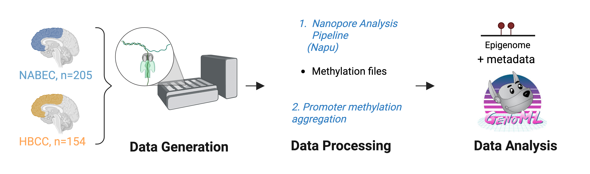

# Long-Read epigenetic clocks identify improved brain aging predictions

`CARD ❤️ Open Science 😍`

**Last Updated:** July 2025

## **Summary**

This repository contains the code, data workflows, and results associated with the manuscript: ***Long-Read epigenetic clocks identify improved brain aging predictions.***

This study utilizes long-read sequencing data in tandem with GenoML to develop enhanced methylation clocks. 

## **Data Statement**

Human brain sequencing datasets are under controlled access and require a dbGap application (phs001300.v5) (phs000979.v4). Afterwards, the data will be available through the restricted AnVIL workspace.


## **Citation**

If you use this repository or find it helpful for your research, please cite the corresponding manuscript (pre-print):

> **Long-Read epigenetic clocks identify improved brain aging predictions**

---

## **Workflow Overview**




---

## **Repository Orientation**
The `scripts/` directory includes all the analyses discussed in the manuscript.
```
this_repository
├── scripts
│   ├── 00_initialize_directories.sh
│   ├── 01_unzip_files.sh
│   ├── 02_merge_haplotypes.py
│   ├── 03_aggregate_promoters.py
│   ├── 04_calculate_pcs.py
│   ├── 05_process_metadata.py
│   ├── 06_metadata_promoter_merge.py
│   ├── 07_promoter_regressions.py
│   ├── 08_merge_sig_promoters.py
│   ├── 09_extract_clocks.py
│   ├── 10_prep_for_genoml.py
│   ├── 11_exec_genoml.sh
│   ├── 12_significant_genes.py
│   ├── 13_shap.py
│   ├── 14_gene_promoter_overlaps.py
│   ├── 15_generate_figs_and_tables.py
│   └── main.sh
├── README.md
└── workflow_diagram.png
```

---

## **Analysis Scripts**

| Script                           | Description                                                                                               |
| -------------------------------- | --------------------------------------------------------------------------------------------------------- |
| `main.sh`                        | Main script to run the full analysis pipeline.                                                            |
| `00_initialize_directories.sh`   | Create output directories and download promoter/gene mapping file.                                        |
| `01_unzip_files.sh`              | Decompress methylation files and store in output directory.                                               |
| `02_merge_haplotypes.py`         | For HBCC phased data, merge haplotypes togteher.                                                          |
| `03_aggregate_promoters.py`      | Use promoter position .bed file to aggregate signal across each promoter.                                 |
| `04_calculate_pcs.py`            | Calculate principal components from methylation data for each cohort.                                     |
| `05_process_metadata.py`         | Standardize and save metadata and generate plots for age distribution and feature correlation.            |
| `06_metadata_promoter_merge.py`  | Merge promoter methylation reads with metadata for each participant.                                      |
| `07_promoter_regressions.py`     | Remove promoters that are highly correlated with others or that are not predictive of age.                |
| `08_merge_sig_promoters.py`      | Merge chunks from the previous step to get final promoter feature data.                                   |
| `09_extract_clocks.py`           | Extract CpGs and nearest promoters to previously-existing clocks from long-read datasets.                 |
| `10_prep_for_genoml.py`          | Merge final promoter data and metadata and apply train/test splits.                                       |
| `11_exec_genoml.sh`              | Run the full GenoML pipeline.                                                                             |
| `12_significant_genes.py`        | Find promoters included in the ancestry-informed models that are most significantly predictive of age.    |
| `13_shap.py`                     | Generate feature importance plots for ancestry-informed models.                                           |
| `14_gene_promoter_overlaps.py`   | Find the numbers of overlapping promoters and genes between previous clocks and ancestry-informed models. |
| `15_generate_figs_and_tables.py` | Generate final figures and tables for the manuscript.                                                     |

---

## **Software**

| Software             | Version(s) | URL                                                 | Notes                              |
| -------------------- | ---------- | --------------------------------------------------- | ---------------------------------- |
| Python               | 3.12.11    | [python.org](https://www.python.org/)               | Main analysis language             |
| GenoML               | 1.5.4      | [github.com](https://github.com/GenoML/genoml2)     | Machine learning model development |
| SHAP                 | 0.48.0     | [shap.readthedocs.io](https://shap.readthedocs.io/) | Model interpretation               |
